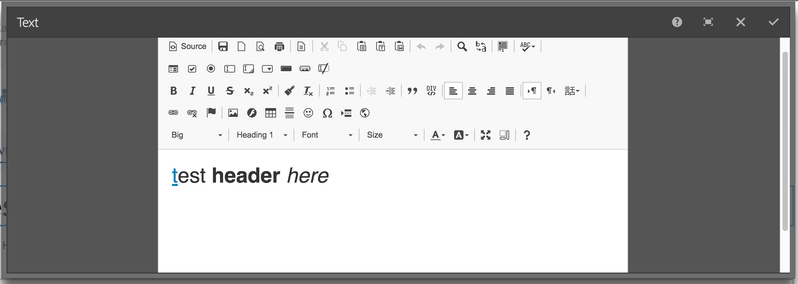

# CKEditor Granite widget

This project is a simple granite ui widget to add a CKEditor field to AEM Touch-UI dialogs.

:exclamation::exclamation::exclamation: This project is for illustrating how to integrate CKEditor. Please do not use in production unless you understand how it works and what it would take to support it.

This project is based on the [gradle-aem-example](https://github.com/Cognifide/gradle-aem-example) which is based on the [gradle-aem-plugin](https://github.com/Cognifide/gradle-aem-plugin)




## Environment

Tested on:

* Java 1.8
* Gradle 4.0
* Adobe AEM 6.2

## Build

```sh
# generate idea config
./gradlew idea

# generate eclipse config
./gradlew eclipse

# build package to /build/distributions/
./gradlew build

# deploy package to AEM
./gradlew aemDeploy

# deploy package... runs default tasks 'clean' 'build' 'aemDeploy' in that order.
./gradlew

```

## Usage

add it just like you'd add any granite ui widget to a dialog. use `sling:resourceType="/apps/ckeditor"`

sample:

```
<text jcr:primaryType="nt:unstructured" 
	  name="./text"
	  sling:resourceType="/apps/ckeditor">
</text>
```

## list of plugins in the full CKeditor:

 - a11yhelp
 - about
 - basicstyles
 - bidi
 - blockquote
 - clipboard
 - colorbutton
 - colordialog
 - contextmenu
 - copyformatting
 - dialogadvtab
 - div
 - elementspath
 - enterkey
 - entities
 - filebrowser
 - find
 - flash
 - floatingspace
 - font
 - format
 - forms
 - horizontalrule
 - htmlwriter
 - iframe
 - image
 - indentblock
 - indentlist
 - justify
 - language
 - link
 - list
 - liststyle
 - magicline
 - maximize
 - newpage
 - pagebreak
 - pastefromword
 - pastetext
 - preview
 - print
 - removeformat
 - resize
 - save
 - scayt
 - selectall
 - showblocks
 - showborders
 - smiley
 - sourcearea
 - specialchar
 - stylescombo
 - tab
 - table
 - tableselection
 - tabletools
 - templates
 - toolbar
 - undo
 - wsc
 - wysiwygarea
